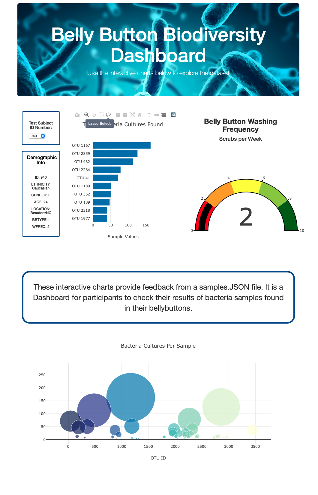

# Plotly_Bellybutton_Biodiversity

## Summary
In this project we used Plotly and JavaScript to create an interactive dashboard.

## Technologies Used
- Github
- Google
- VS Code
- Zsh Terminal
- D3.js
- Plotly
- JSON
- JavaScript
- HTML
- CSS
- Bootstrap CDN